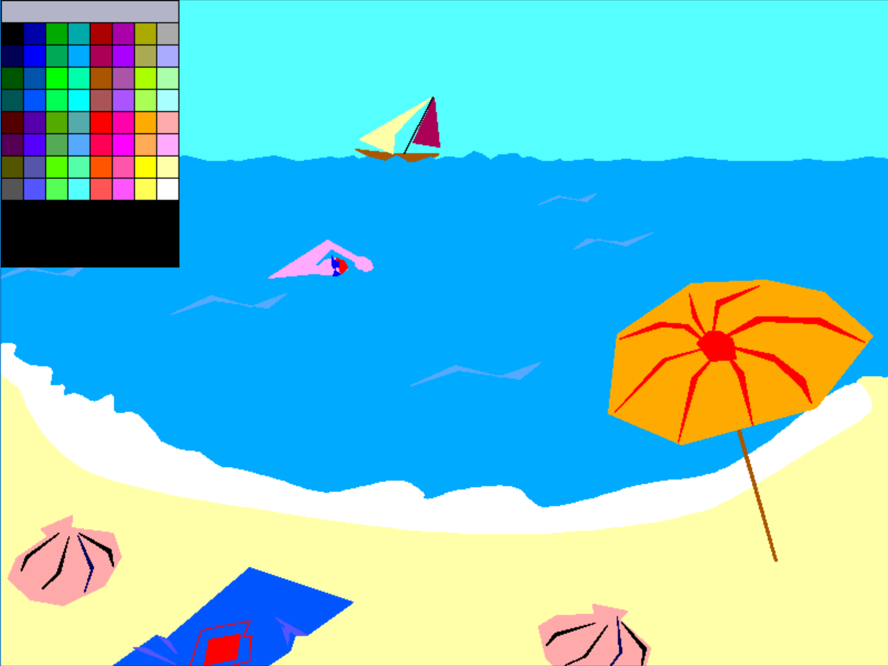
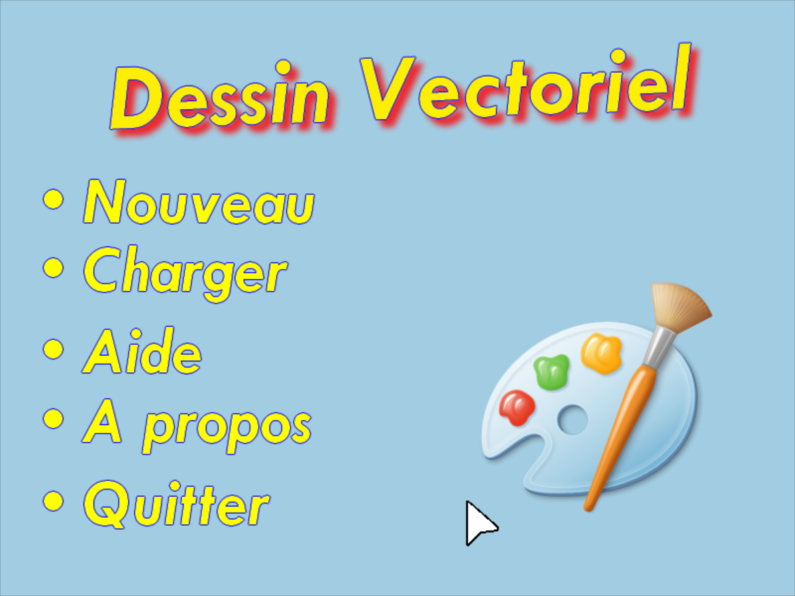

Second year project.
Vectorial Drawing Software developed in C with graphics library Allegro 4.2.

The user has two modes: add and edit.
In the "add" mode, the user can draw polygons of any color.
In the "edit" mode, the user can select a polygon or multiple polygons and:
- change their color
- shrink or enlarge them
- rotate them
- move them
- smoothen their shape
- cut, copy, paste, delete

The user can save his drawings to a file  and reload them for future use.

Credits:  Gabriel M.R. , Guillaume Q.

---------
Instructions to compile and run:
You need to install and link allegro 4.2
